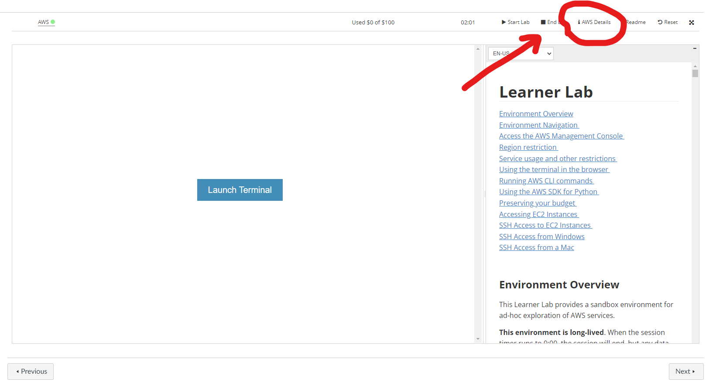
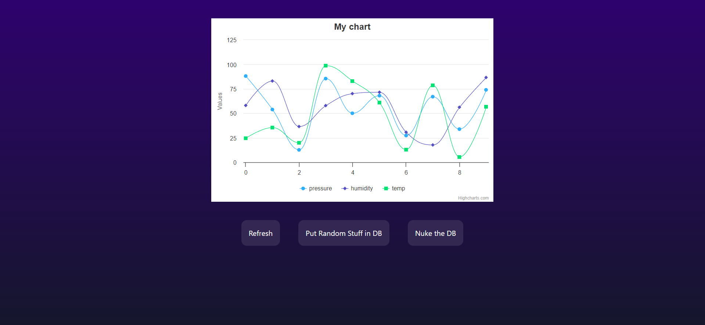

# Create T3 App

# Setup
1. Clone repo
2. Make a copy of `.env.example` file and name it `.env`.
3. Get the credentials from 
    
    Click "Show" near AWS CLI
4. Set the table name from DynamoDB

5. `npm run dev` to run the app

# Usage:
1. The refresh button gets data from database and displays on graph
2. The random data button adds 10 random data points from 3 sensors
3. The nuke button deletes all items in database

The actions won't exactly be instantaneous.

**Example:** After pressing the random data button, all 10 newly added items might not be retrieved during refresh. But after 2 seconds, on manual refresh, the data appears.